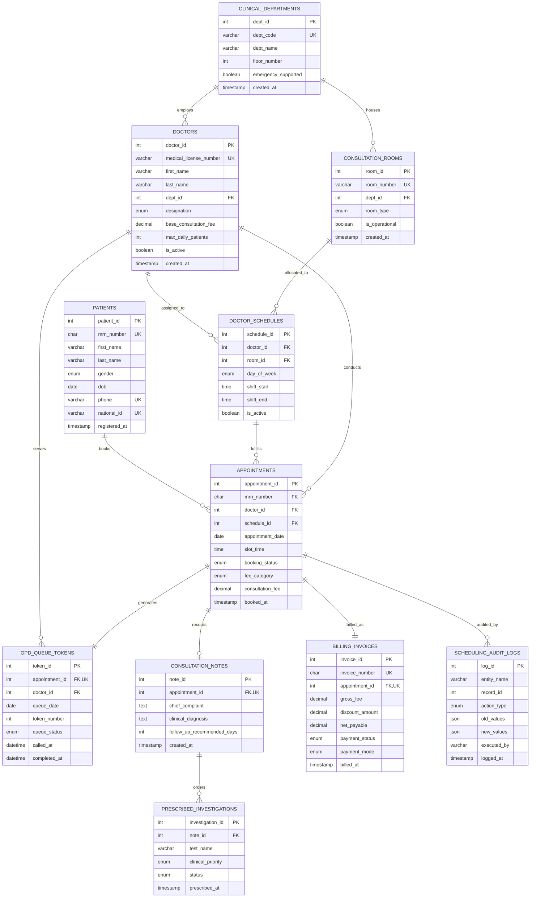

# Entity Relationship Diagram & Data Dictionary

## System Overview
The **Hospital OPD Multi-Specialty Appointment & Room Scheduling System** coordinates outpatient medical appointments, clinical room allocations, duty rosters, patient token queues, clinical documentation, diagnostic ordering, and billing transactions.

The schema is normalized to **Third Normal Form (3NF)** with strict Boyce-Codd considerations, eliminating update, insertion, and deletion anomalies while maintaining referential integrity across all clinical operations.

---

## Mermaid.js Crow's Foot ER Diagram

---

## Entity Relationship Cardinality Table

| Parent Entity | Child Entity | Relationship Type | Foreign Key | Cardinality Ratio | Business Semantic |
| :--- | :--- | :--- | :--- | :--- | :--- |
| `clinical_departments` | `consultation_rooms` | One-to-Many (1:N) | `dept_id` | $1 : 0..N$ | A department contains multiple physical consultation rooms. |
| `clinical_departments` | `doctors` | One-to-Many (1:N) | `dept_id` | $1 : 0..N$ | A department employs medical practitioners and specialists. |
| `consultation_rooms` | `doctor_schedules` | One-to-Many (1:N) | `room_id` | $1 : 0..N$ | A physical room is scheduled for shifts across doctors. |
| `doctors` | `doctor_schedules` | One-to-Many (1:N) | `doctor_id` | $1 : 0..N$ | A physician holds multiple weekly duty roster slots. |
| `patients` | `appointments` | One-to-Many (1:N) | `mrn_number` | $1 : 0..N$ | A patient can book multiple outpatient consultations. |
| `doctors` | `appointments` | One-to-Many (1:N) | `doctor_id` | $1 : 0..N$ | A doctor conducts multiple booked appointments. |
| `doctor_schedules` | `appointments` | One-to-Many (1:N) | `schedule_id` | $1 : 0..N$ | An appointment maps to an active roster timetable shift. |
| `appointments` | `opd_queue_tokens` | One-to-One (1:1) | `appointment_id` | $1 : 1$ | Every active appointment has exactly one sequential queue token. |
| `appointments` | `consultation_notes` | One-to-One (1:0..1) | `appointment_id` | $1 : 0..1$ | Completed appointments result in clinical EHR notes. |
| `consultation_notes` | `prescribed_investigations` | One-to-Many (1:N) | `note_id` | $1 : 0..N$ | A doctor can order zero or more laboratory/imaging tests. |
| `appointments` | `billing_invoices` | One-to-One (1:1) | `appointment_id` | $1 : 1$ | Every confirmed appointment produces one atomic invoice. |

---

## Comprehensive Data Dictionary

### 1. `clinical_departments`
*Stores medical specialty divisions within the hospital.*

| Column Name | Data Type | Nullable | Default | Constraints | Description |
| :--- | :--- | :--- | :--- | :--- | :--- |
| `dept_id` | `INT` | NO | `AUTO_INCREMENT` | `PRIMARY KEY` | Surrogate department identifier. |
| `dept_code` | `VARCHAR(10)` | NO | None | `UNIQUE` | Short specialty acronym (e.g., 'CARD', 'PEDS'). |
| `dept_name` | `VARCHAR(100)` | NO | None | None | Official clinical department name. |
| `floor_number` | `INT` | NO | None | `CHECK (-2 to 20)` | Building floor where department resides. |
| `emergency_supported` | `BOOLEAN` | NO | `TRUE` | None | Indicates 24/7 acute triage support. |
| `created_at` | `TIMESTAMP` | NO | `CURRENT_TIMESTAMP` | None | Record ingestion timestamp. |

---

### 2. `consultation_rooms`
*Physical clinical examination suites and specialized procedure rooms.*

| Column Name | Data Type | Nullable | Default | Constraints | Description |
| :--- | :--- | :--- | :--- | :--- | :--- |
| `room_id` | `INT` | NO | `AUTO_INCREMENT` | `PRIMARY KEY` | Surrogate room identifier. |
| `room_number` | `VARCHAR(20)` | NO | None | `UNIQUE` | Physical door room number (e.g., 'CR-101'). |
| `dept_id` | `INT` | NO | None | `FK -> clinical_departments` | Department owning this physical suite. |
| `room_type` | `ENUM` | NO | `'Consultation'` | Values: Consultation, Procedure, Specialist_Suite | Classification of room equipment/purpose. |
| `is_operational` | `BOOLEAN` | NO | `TRUE` | None | Maintenance/availability flag. |
| `created_at` | `TIMESTAMP` | NO | `CURRENT_TIMESTAMP` | None | Room onboarding timestamp. |

---

### 3. `doctors`
*Licensed medical professionals affiliated with clinical departments.*

| Column Name | Data Type | Nullable | Default | Constraints | Description |
| :--- | :--- | :--- | :--- | :--- | :--- |
| `doctor_id` | `INT` | NO | `AUTO_INCREMENT` | `PRIMARY KEY` | Surrogate doctor identifier. |
| `medical_license_number`| `VARCHAR(30)`| NO | None | `UNIQUE` | State medical council registration number. |
| `first_name` | `VARCHAR(50)` | NO | None | None | Doctor's first name. |
| `last_name` | `VARCHAR(50)` | NO | None | None | Doctor's last name. |
| `dept_id` | `INT` | NO | None | `FK -> clinical_departments` | Department of primary affiliation. |
| `designation` | `ENUM` | NO | `'Medical_Officer'` | Academic/Clinical rank | Medical_Officer, Senior_Registrar, Assistant_Professor, Consultant_Professor. |
| `base_consultation_fee` | `DECIMAL(8,2)`| NO | None | `CHECK (> 0)` | Standard outpatient consultation charge. |
| `max_daily_patients` | `INT` | NO | `30` | `CHECK (> 0)` | Maximum safe caseload per working day. |
| `is_active` | `BOOLEAN` | NO | `TRUE` | None | Active clinical practice status. |
| `created_at` | `TIMESTAMP` | NO | `CURRENT_TIMESTAMP` | None | Registration timestamp. |

---

### 4. `doctor_schedules`
*Master duty roster assigning doctors to consultation rooms on specific days and shifts.*

| Column Name | Data Type | Nullable | Default | Constraints | Description |
| :--- | :--- | :--- | :--- | :--- | :--- |
| `schedule_id` | `INT` | NO | `AUTO_INCREMENT` | `PRIMARY KEY` | Surrogate schedule identifier. |
| `doctor_id` | `INT` | NO | None | `FK -> doctors` | Assigned medical practitioner. |
| `room_id` | `INT` | NO | None | `FK -> consultation_rooms` | Assigned consultation room. |
| `day_of_week` | `ENUM` | NO | None | 'Mon'..'Sun' | Day of weekly recurring shift. |
| `shift_start` | `TIME` | NO | None | `CHECK (start < end)` | Operational shift commencement time. |
| `shift_end` | `TIME` | NO | None | None | Operational shift conclusion time. |
| `is_active` | `BOOLEAN` | NO | `TRUE` | None | Roster active state flag. |

*Compound Keys*:
- `UNIQUE(doctor_id, day_of_week, shift_start)`: Prevents assigning one doctor to multiple rooms at the same time.
- `UNIQUE(room_id, day_of_week, shift_start)`: Prevents assigning multiple doctors to the same room at the same start time.

---

### 5. `patients`
*Master patient demographic records.*

| Column Name | Data Type | Nullable | Default | Constraints | Description |
| :--- | :--- | :--- | :--- | :--- | :--- |
| `patient_id` | `INT` | NO | `AUTO_INCREMENT` | `PRIMARY KEY` | Internal surrogate identifier. |
| `mrn_number` | `CHAR(10)` | NO | None | `UNIQUE` | Unique Medical Record Number (e.g., 'MRN-100001'). |
| `first_name` | `VARCHAR(50)` | NO | None | None | Patient's given name. |
| `last_name` | `VARCHAR(50)` | NO | None | None | Patient's family name. |
| `gender` | `ENUM` | NO | None | 'M', 'F', 'Other' | Biological gender identity. |
| `dob` | `DATE` | NO | None | None | Date of birth (used for age calculations). |
| `phone` | `VARCHAR(20)` | NO | None | `UNIQUE` | Primary emergency contact number. |
| `national_id` | `VARCHAR(30)` | NO | None | `UNIQUE` | Government social security or identity number. |
| `registered_at` | `TIMESTAMP` | NO | `CURRENT_TIMESTAMP` | None | Initial patient registration timestamp. |

---

### 6. `appointments`
*Core consultation booking entity.*

| Column Name | Data Type | Nullable | Default | Constraints | Description |
| :--- | :--- | :--- | :--- | :--- | :--- |
| `appointment_id` | `INT` | NO | `AUTO_INCREMENT` | `PRIMARY KEY` | Surrogate appointment identifier. |
| `mrn_number` | `CHAR(10)` | NO | None | `FK -> patients` | Patient attending the consultation. |
| `doctor_id` | `INT` | NO | None | `FK -> doctors` | Physician conducting the consultation. |
| `schedule_id` | `INT` | NO | None | `FK -> doctor_schedules` | Roster schedule validating the shift. |
| `appointment_date` | `DATE` | NO | None | None | Calendar date of consultation. |
| `slot_time` | `TIME` | NO | None | None | Designated time slot of appointment. |
| `booking_status` | `ENUM` | NO | `'Confirmed'` | Confirmed, CheckedIn, Completed, Cancelled, NoShow | Appointment lifecycle state. |
| `fee_category` | `ENUM` | NO | `'Standard'` | Standard, FollowUp, SeniorCitizen, Emergency | Triage pricing bracket. |
| `consultation_fee` | `DECIMAL(8,2)`| NO | None | `CHECK (>= 0)` | Net fee calculated for this booking. |
| `booked_at` | `TIMESTAMP` | NO | `CURRENT_TIMESTAMP` | None | Booking creation timestamp. |

*Compound Unique*: `UNIQUE(doctor_id, appointment_date, slot_time)` ensures no doctor is double-booked for the same time slot.

---

### 7. `opd_queue_tokens`
*Daily outpatient triage queue sequence tracking.*

| Column Name | Data Type | Nullable | Default | Constraints | Description |
| :--- | :--- | :--- | :--- | :--- | :--- |
| `token_id` | `INT` | NO | `AUTO_INCREMENT` | `PRIMARY KEY` | Surrogate token identifier. |
| `appointment_id` | `INT` | NO | None | `FK -> appointments, UNIQUE` | 1:1 link to the parent appointment. |
| `doctor_id` | `INT` | NO | None | `FK -> doctors` | Physician queue bucket. |
| `queue_date` | `DATE` | NO | None | None | Date of queue execution. |
| `token_number` | `INT` | NO | None | `CHECK (> 0)` | Sequential token for the doctor on that date. |
| `queue_status` | `ENUM` | NO | `'Waiting'` | Waiting, In_Consultation, Serviced, Skipped | Live status on OPD display screens. |
| `called_at` | `DATETIME` | YES | `NULL` | None | Timestamp when patient token was called. |
| `completed_at` | `DATETIME` | YES | `NULL` | None | Timestamp when consultation finished. |

*Compound Unique*: `UNIQUE(doctor_id, queue_date, token_number)` guarantees token numbers are strictly sequential without collision.

---

### 8. `consultation_notes`
*Physician clinical findings and diagnosis (EHR).*

| Column Name | Data Type | Nullable | Default | Constraints | Description |
| :--- | :--- | :--- | :--- | :--- | :--- |
| `note_id` | `INT` | NO | `AUTO_INCREMENT` | `PRIMARY KEY` | Surrogate note identifier. |
| `appointment_id` | `INT` | NO | None | `FK -> appointments, UNIQUE` | 1:1 link to attended appointment. |
| `chief_complaint` | `TEXT` | NO | None | None | Patient's primary presenting symptoms. |
| `clinical_diagnosis` | `TEXT` | NO | None | None | Medical diagnosis determined by doctor. |
| `follow_up_recommended_days` | `INT` | NO | `0` | `CHECK (>= 0)` | Recommended return interval in days. |
| `created_at` | `TIMESTAMP` | NO | `CURRENT_TIMESTAMP` | None | Clinical documentation timestamp. |

---

### 9. `prescribed_investigations`
*Laboratory and diagnostic imaging orders linked to clinical encounters.*

| Column Name | Data Type | Nullable | Default | Constraints | Description |
| :--- | :--- | :--- | :--- | :--- | :--- |
| `investigation_id` | `INT` | NO | `AUTO_INCREMENT` | `PRIMARY KEY` | Surrogate diagnostic order identifier. |
| `note_id` | `INT` | NO | None | `FK -> consultation_notes` | Encounter note recommending the test. |
| `test_name` | `VARCHAR(100)` | NO | None | None | Name of test (e.g., '12-Lead ECG'). |
| `clinical_priority`| `ENUM` | NO | `'Routine'` | Routine, Urgent, Stat | Urgency level for lab/radiology triage. |
| `status` | `ENUM` | NO | `'Pending'` | Pending, Sample_Collected, Reported | Diagnostic processing stage. |
| `prescribed_at` | `TIMESTAMP` | NO | `CURRENT_TIMESTAMP` | None | Order creation timestamp. |

---

### 10. `billing_invoices`
*Financial transactions and patient receipts.*

| Column Name | Data Type | Nullable | Default | Constraints | Description |
| :--- | :--- | :--- | :--- | :--- | :--- |
| `invoice_id` | `INT` | NO | `AUTO_INCREMENT` | `PRIMARY KEY` | Surrogate invoice identifier. |
| `invoice_number` | `CHAR(12)` | NO | None | `UNIQUE` | Fiscal billing reference (INVYYMMDDXXX). |
| `appointment_id` | `INT` | NO | None | `FK -> appointments, UNIQUE` | 1:1 link to booked consultation. |
| `gross_fee` | `DECIMAL(8,2)`| NO | None | `CHECK (>= 0)` | Doctor's base consultation fee. |
| `discount_amount` | `DECIMAL(8,2)`| NO | `0.00` | `CHECK (>= 0)` | Senior/Follow-up discount deduction. |
| `net_payable` | `DECIMAL(8,2)`| NO | None | `CHECK (>= 0)` | Final fee collected from patient. |
| `payment_status` | `ENUM` | NO | `'Paid'` | Paid, Waived, Refunded | Financial settlement status. |
| `payment_mode` | `ENUM` | NO | None | Cash, Card, Insurance, DigitalWallet | Channel of payment reception. |
| `billed_at` | `TIMESTAMP` | NO | `CURRENT_TIMESTAMP` | None | Billing transaction timestamp. |

---

### 11. `scheduling_audit_logs`
*Immutable system ledger tracking security events and operational changes.*

| Column Name | Data Type | Nullable | Default | Constraints | Description |
| :--- | :--- | :--- | :--- | :--- | :--- |
| `log_id` | `INT` | NO | `AUTO_INCREMENT` | `PRIMARY KEY` | Surrogate audit entry identifier. |
| `entity_name` | `VARCHAR(50)` | NO | None | None | Name of audited table (e.g., 'appointments'). |
| `record_id` | `INT` | NO | None | None | Primary key value of the affected record. |
| `action_type` | `ENUM` | NO | None | Event types | APPOINTMENT_BOOKED, RESCHEDULED, CANCELLED, ROOM_OVERRIDE, TOKEN_SKIPPED. |
| `old_values` | `JSON` | YES | `NULL` | None | Prior state snapshot in JSON format. |
| `new_values` | `JSON` | YES | `NULL` | None | Updated state snapshot in JSON format. |
| `executed_by` | `VARCHAR(50)` | NO | `'SYSTEM'` | None | User/session actor performing mutation. |
| `logged_at` | `TIMESTAMP` | NO | `CURRENT_TIMESTAMP` | None | Audit log insertion timestamp. |

---

## Normalization Justification (1NF to 3NF)

1. **First Normal Form (1NF)**:
   - All columns contain atomic, non-decomposable values (e.g., `chief_complaint` is separate from `clinical_diagnosis`; tests are stored as individual rows in `prescribed_investigations` rather than comma-separated lists).
   - Each table possesses an unambiguous primary key (`dept_id`, `doctor_id`, `appointment_id`, etc.).

2. **Second Normal Form (2NF)**:
   - The schema satisfies 1NF and contains zero partial functional dependencies.
   - For composite-keyed or surrogate-keyed tables, all non-key attributes depend fully on the complete primary key. In `doctor_schedules`, the timing and room attributes depend strictly on `schedule_id`.

3. **Third Normal Form (3NF)**:
   - The schema satisfies 2NF and contains zero transitive dependencies ($X \to Y$ and $Y \to Z$ where $Z$ is non-prime).
   - In `appointments`, the patient's phone and date of birth are NOT duplicated; only `mrn_number` is referenced as a foreign key.
   - In `billing_invoices`, the doctor's name or room number are NOT stored; they are derived through `appointment_id`.
   - Age is NOT stored statically in `patients` (which would cause data staleness and transitive anomalies); it is dynamically computed using the deterministic function `fn_calculate_patient_age()`.
